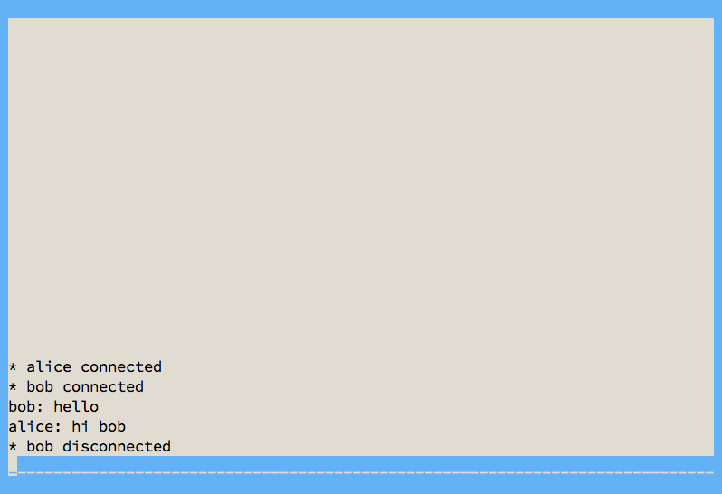

This is an attempt at a
slightly-more-involved-but-still-small-enough-to-be-an-example example of a
chat server using [tokio](https://tokio.rs). There are three crates present here:

* `tokio-chat-common` provides message data types and [codecs](https://docs.rs/tokio-core/0.1.3/tokio_core/io/trait.Codec.html) for client/server communication
* `tokio-chat-server` has hopefully well-annotated source code (PRs/feedback welcome!)
* `tokio-chat-client` has slightly-less-well-annotated source code and provides a [Cursive](https://crates.io/crates/cursive)-based textual interface to the server.

Compiling `tokio-chat-common` - and therefore running either the client or server - requires procedural macros because of its use of [serde](https://crates.io/crates/serde), and so requires Rust 1.15 or later (which is still in beta at the time of this writing). If you're using `rustup`, something like this should work:

```
cd tokio-chat-server
rustup run beta cargo run
```

and then in another window:

```
cd tokio-chat-client
rustup run beta cargo run -- username1
```

(and possibly the above multiple times, probably with different usernames if you want to be able to tell them apart). If all goes well, you should be able to type in the client windows and see something like this:



## Author

John Gallagher, johnkgallagher@gmail.com

## License

tokio-chat-example is available under the MIT license. See the LICENSE file for more info.
